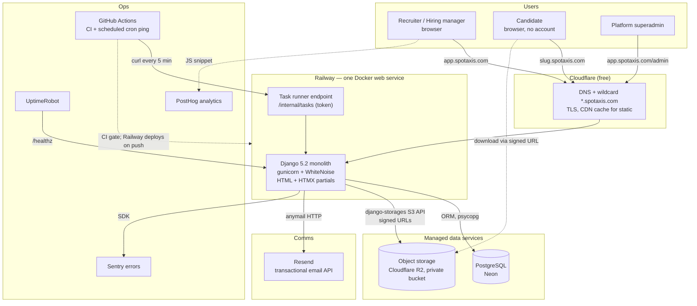
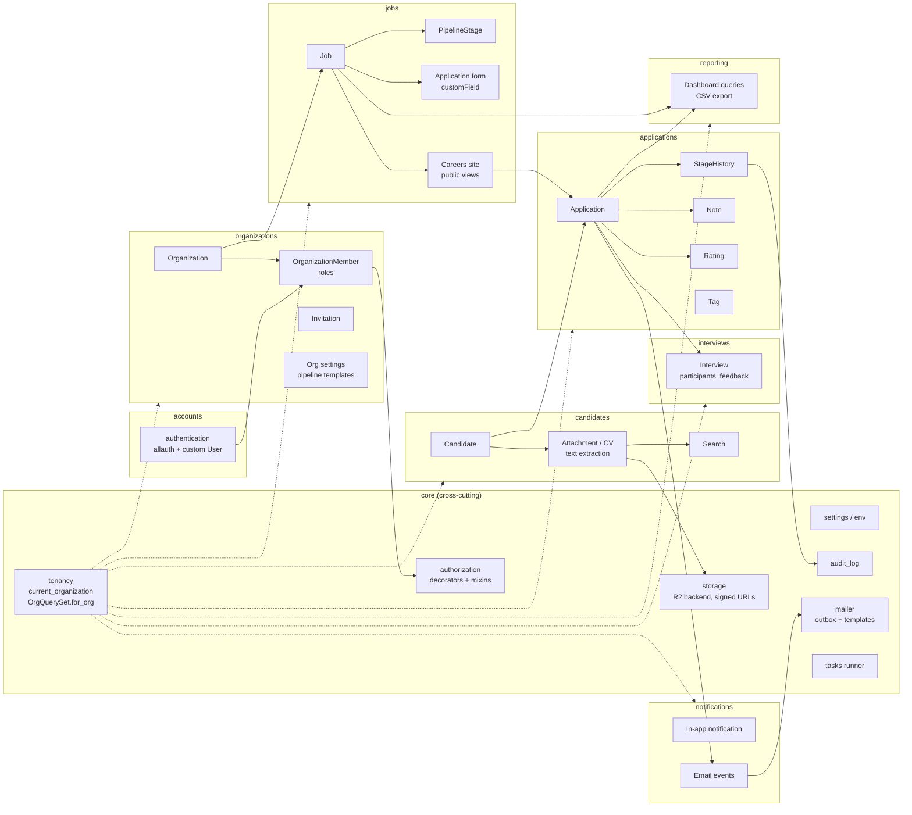
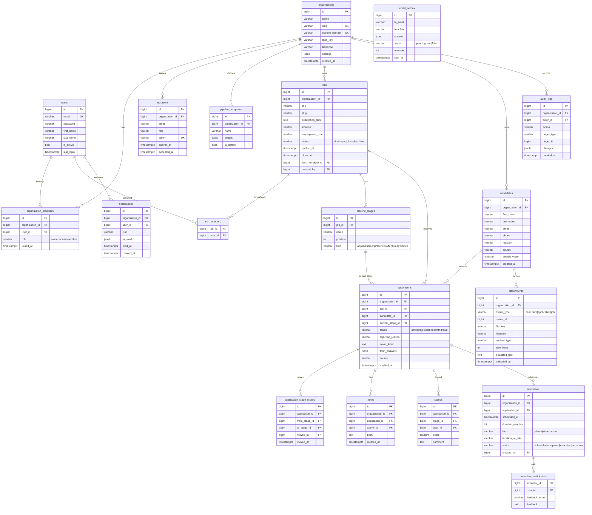
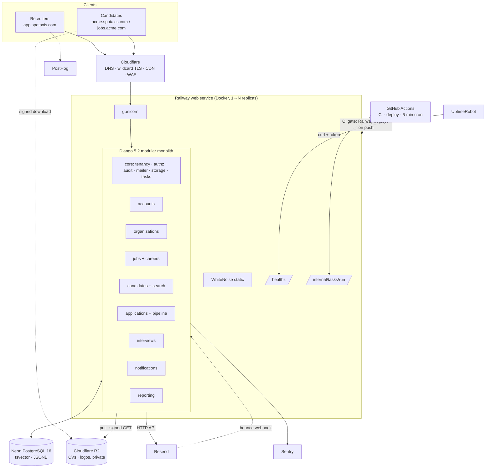

# SpotAxis MVP Architecture Plan

*Assessment of the existing SpotAxis ATS and the target architecture, migration strategy, cost model and roadmap for a commercially viable, near-zero-cost MVP. Prepared 2026-09-03 for a team of 2–3 developers. No code has been changed.*

---

## Executive summary

**Recommendation: keep the Django modular monolith, harden it, and progressively replace its weakest layers. Do not rewrite.**

SpotAxis is a Django 5.2 / Python 3.12 monolith (~30k lines of first-party Python, ~85k lines of templates) that was ported from Django 1.9 during 2025. The domain model is real and largely correct: organizations, recruiters with roles, jobs with per-job pipeline stages, applications with stage tracking, ratings, comments, custom application forms, CV upload and parsing, per-tenant career sites on subdomains. A Next.js + Supabase rewrite would throw away that domain logic and re-implement it in TypeScript with a 2–3 person team. There is no technical reason strong enough to justify that.

What *is* wrong is concentrated and fixable:

- **Security**: five critical holes (unauthenticated team-takeover AJAX endpoints, forgeable invitation tokens, unauthenticated DRF routers over all tenant data, `ALLOWED_HOSTS = ['*']`, cross-tenant IDOR on job-team management). All are view-layer bugs, not architectural ones.
- **Dead weight**: ~28,600 lines of vendored, disabled apps (`zinnia`, `helpdesk`, `helpdesk_api`), ~5,000 lines of unused DRF API, dead social-login code, and heavy unused dependencies (pandas, scipy, nltk, selenium).
- **Tenancy by convention**: no tenant-aware manager; every view hand-scopes (or forgets to). Recruiter→Company is a M2M used as a FK.
- **Operations**: MySQL, local-disk media served by Django, `django_crontab`, no Dockerfile, no CI, no tests for core apps, committed TLS private keys.
- **Frontend**: jQuery 1.12 + Bootstrap 3 with 23k lines of inline JS in templates.

**Target stack (one recommendation):** Django 5.2 monolith · PostgreSQL on Neon · Django auth + django-allauth · Cloudflare R2 for files · Resend for email · Railway for hosting (Docker) · Cloudflare DNS/CDN · Sentry + UptimeRobot · PostHog. Server-rendered templates with HTMX + Alpine.js + Bootstrap 5, no build step.

**Cost:** $0/month for development; ~$6–8/month for a live staging/production service; ~$65–95/month at 100 organizations.

**Effort:** roughly 45–55 developer-days for the MVP. Best case 6 weeks, realistic 9–10 weeks with 2–3 developers.

---

## Phase 1 — Existing System Assessment

### 1.1 Stack inventory

| Area | Current state | Verdict |
|---|---|---|
| **Language / framework** | Python 3.12, Django 5.2.1 (ported from 1.9 in May–Jul 2025). `uv` + `pyproject.toml` for dependencies; `requirements.txt` is a UTF-16 artefact and unusable. | Keep |
| **Frontend** | 100% server-rendered Django templates. Bootstrap 3.3.4 (a second 3.3.6 copy under `newtheme/`), jQuery 1.12.4 (four jQuery versions vendored), jQuery UI sortable for the pipeline board, CKEditor (vendored twice), Selectize, Moment. ~94k lines of vendored JS, only ~700 lines of first-party JS files, but **~23,300 lines of inline JavaScript across 171 templates**. No package.json, no bundler. | Refactor progressively |
| **Backend architecture** | Modular Django apps: `common` (User, auth, 3,379-line `ajax.py` with ~90 function views), `companies` (Company, Recruiter, Stage, invitations), `vacancies` (Vacancy, VacancyStage, Postulate, Comment, scores), `candidates` (Candidate + CV sub-tables), `customField` (form builder), `activities` (notifications), `scheduler` (interview slot), `payments` (PayPal plans), `resume_parser`. Two 255/355-line URL files with ~40 byte-duplicated routes. | Keep structure, refactor view layer |
| **Database** | MySQL 8.4 via PyMySQL. 76 first-party models, 153 migrations (56 in `vacancies` alone). Four unique constraints in the whole project, no `db_index`, no `unique_together(vacancy, candidate)` on applications. | Replace with PostgreSQL |
| **Authentication** | Django `ModelBackend` with custom `common.User` (extends `AbstractUser`, `USERNAME_FIELD = username`). Role via nullable `User.profile` FK (recruiter / candidate / Admin) plus `Recruiter.membership` int (1 member, 2 manager, 3 admin) plus `is_superuser`. Email activation via `AccountVerification` (sha1 of `random.random()`). Hand-rolled 705-line `social_login` view is dead code that 500s (references settings that don't exist). `python-social-auth` not installed; all `SOCIAL_AUTH_*` settings inert. | Keep Django auth, add allauth, delete social code |
| **APIs** | DRF 3.16 with `DEFAULT_PERMISSION_CLASSES = [AllowAny]`. `companies_api` (26 ModelViewSets), `vacancies_api` (18 APIViews), `common.api` (32 endpoints incl. users and verification tokens), `activities.api`, `helpdesk_api` (unrouted). **Nothing consumes them** — the UI calls `/ajax/...` function views only. | Remove |
| **File / document storage** | Local filesystem `MEDIA_ROOT`, served by `django.views.static.serve` unconditionally (outside any DEBUG guard) in all four URL confs. CVs at `candidates/<id>/cv-file/`, logos, photos, vacancy attachments, CKEditor uploads. No django-storages, no S3. Unauthenticated `csrf_exempt` upload endpoint at `/ajax-uploads/`. | Replace with R2 |
| **Email / notifications** | SMTP via `EmailMultiAlternatives` through `send_TRM_email()`, which swallows all exceptions and returns 0. 29 email templates. Several call sites pass template names as 1-tuples (trailing comma) so activation, invitation and application-received emails fail silently; activation path also raises `NameError`. In-app `Notification` + `Activity` models with fan-out helpers; context processor runs 2 queries and dirties the session on every page. **No stage-change or interview email exists.** | Refactor |
| **Background jobs** | `django_crontab`: subscription cron every minute (loads all subscriptions into memory; imports a non-existent name so it has never run), publish/unpublish at midnight. No Celery/RQ. `scheduler` app is interview data, not a job runner; nothing fires reminders. | Replace |
| **Hosting / deployment** | Nothing. No Dockerfile, Procfile, compose, CI workflow. `ssl/` contains committed Let's Encrypt private keys. `setup/config.json` ships a real-looking Gmail address and password. `install.py` generates `.env`. Static served by Django. | Add |
| **Multi-tenancy** | Tenant = `Company`, routed by Host header → `common.Subdomain` (cname or slug) → `SubdomainMiddleware` swaps `urlconf`. Recruiters must log in *on the tenant subdomain* (sessions are per host). Candidates are global platform users, not tenant-scoped. Scoping is manual per view. | Refactor |
| **Third-party deps** | Live and needed: Django, DRF (to be dropped), Pillow, pdfminer.six, python-docx, mammoth, striprtf, WeasyPrint, hashids, ckeditor. Dead or wrong: `south`, `selenium`, `xvfbwrapper`, `pandas`, `scipy`, `nltk`, `pyth` (Py2-only), `oauth2`, `python-linkedin`, both `rosetta` and `django-rosetta`, `django-tagging` (needs a `smart_text` monkey-patch, only for zinnia), `django-xmlrpc`, `mots-vides`, `textile`, `paypalrestsdk` (deprecated v1 SDK). | Prune |
| **Tests / quality** | Zero tests in `companies`, `candidates`, `vacancies`, `common/ajax.py`. 8 of 15 tests in `common` fail (assert a different User model). 294 bare `except:`, 96 stray `print()`, ~2,900 commented-out Python lines, `.pre-commit-config.yaml` pins Python 3.8 so hooks never run. | Add |

### 1.2 Existing ATS features (what actually works today)

Working, with caveats:

- Employer signup → company creation → subdomain career site (five site templates, HTML editor for above/below-jobs blocks).
- Team space: invite recruiters by email, three membership levels, ownership transfer, per-job evaluator assignment.
- Job (vacancy) create/edit with rich text, salary, experience, degree, tags, attachments, publish/unpublish dates, per-job custom application form (`customField`), per-job hiring pipeline built from company-level stage templates with per-stage criteria and evaluators.
- Public job board (apex domain, uses `el_pagination`) and per-company career site listing; job detail page with public Q&A.
- Apply flow: logged-in candidate applies with profile; anonymous "apply with resume" uploads a CV, runs the parser, shows a conflict-resolution screen, then cover letter + custom form.
- Pipeline board per job: sortable columns by stage, move up/down a stage, archive/discard, comments, per-criterion 0–5 ratings by evaluators, comparison view, tags.
- Interview scheduling (date + offset minutes, pending/completed) shown as a widget on the application activity page.
- Activity stream and in-app notifications.
- Candidate CV builder / profile with academics, experience, languages, projects; CV → PDF via WeasyPrint.
- Talent sourcing / curriculum search across candidates.
- Plans, seat limits, PayPal top-ups, wallet ledger, discount codes (billing UI exists; the enforcement middleware only checks seat counts).

### 1.3 Broken, incomplete, duplicated or poorly designed

**Broken**

- Activation email path raises `NameError` (`common/models.py:186`); registration email template references an unregistered URL name (`mails/base_email.html:9`).
- `payments.cron` imports `protocol` from settings (doesn't exist) → never runs.
- `social_login` (705 lines) references non-existent settings and calls `.values()[0]` on a dict → guaranteed 500, still routed.
- `retreive_comments` / `retreive_ratings` are `pass`-only but routed → 500.
- `vacancy_to_pdf` calls `is_authenticated()` as a method → TypeError on Django 5.
- `Subdomain.__str__` is defined outside the class; its `Meta` is unreachable; `slug` has `default=True` on a CharField.
- `ExternalReferal.__str__`, `Wallet.set_available_amount`, `Company.get_job_template` reference attributes that don't exist.
- Public-apply parser path does `dat['name']` on `{}` when parsing fails → KeyError.
- `MEDIA_ROOT` becomes `''` when `.env` sets `media_root=''` (the example does) → uploads land in CWD.
- `media_root=''`, `db_port` falls back to `db_host`.

**Incomplete / dead**

- `zinnia` blog, `helpdesk`, `helpdesk_api`, `socialmultishare`, `example`: disabled but present (28k+ lines, still in `pyproject` packages, still importing at urlconf module top).
- Half of `companies`/`vacancies` view functions have their URL lines commented out (`edit_company`, `search_curricula`, `company_wallet`, `filter_vacancies_by_*`…).
- Parallel, unused, unauthenticated DRF layer (~5k lines).
- `old_*.html` marketing pages, `header`/`new_header` and `footer`/`new_footer` pairs (unfinished redesign), CKEditor `backp/` tree, `.old` JS files, jasmine test runner in prod static.

**Duplicated**

- 13 near-identical `validate_*_form` AJAX views (`common/ajax.py:856–1284`).
- ~40 routes duplicated between `urls.py` and `subdomain_urls.py`.
- `common.SocialAuth` vs `socialmultishare.socialmultishareoauth`; `Training`/`Certificate`/`Project` are identical tables; `VacancyStage.criteria` (`;;`-delimited text) vs `StageCriterion`; `Company.ban_list` text vs `Ban` table; `Postulate.tag` vs `tags` M2M.
- Rating HTML generated in five near-identical model methods.

**Poorly designed**

- Nullable `SET_NULL` FKs on required relationships (`Vacancy.company`, `Postulate.vacancy`, `Postulate.candidate`), then dereferenced in `__str__`.
- `Recruiter.company` is a M2M but every call site uses `.company.all()[0]`; `membership` is one scalar across all companies.
- No stage-transition table: pipeline history is reconstructed from `Comment.comment_type`/`stage_section` codes.
- `Curriculum.save()` shells out to LibreOffice synchronously and calls `self.save()` recursively; `Curriculum.filecontent` stores full CV text in the row.
- `eval("django.forms." + field_type.form_field)` on database strings (`customField/forms.py:298,385`).
- Business logic in the 3,379-line `common/ajax.py`, all `@csrf_exempt` (~70 decorators).
- Hardcoded `spotaxis.com` (75 occurrences), `ROOT_DOMAIN`, `Asia/Kolkata`, `en-IN`, `PriceSlab.objects.get(id=2)` in three places.

### 1.4 Security risks (ordered by severity)

| # | Risk | Where | Severity |
|---|---|---|---|
| 1 | `update_permissions` / `remove_member` are `csrf_exempt` with **no auth or tenant check**: anyone can promote any recruiter to admin of any company, or disable any recruiter account. | `common/ajax.py:1461,1505` | Critical |
| 2 | Invitation / referral tokens are `Hashids(salt='Invitation')` over sequential PKs — computable by anyone; accepting grants attacker-chosen membership in a foreign tenant. | `companies/views.py:47-89` | Critical |
| 3 | DRF routers with `AllowAny`: `GET /api/companies/curriculum-detail/` lists every CV on the platform; `/api/common/users/` lists users and verification tokens; unauthenticated `DELETE`/`PATCH` on applications. | `companies_api/views.py`, `common/api/urls.py` | Critical |
| 4 | `ALLOWED_HOSTS = ['*']` + stock `PasswordResetView` → password-reset link poisoning; tenant resolution trusts the Host header. | `TRM/settings.py:21` | Critical |
| 5 | Cross-tenant IDOR: `add_member_to_job` etc. accept any recruiter id + any vacancy id. | `common/ajax.py:1559-1682` | Critical |
| 6 | Unauthenticated CV/PDF disclosure for any candidate id. | `candidates/views.py:91,624` | High |
| 7 | Unauthenticated, unlimited image upload; cross-tenant vacancy file upload/delete. | `upload_logos/views.py:11`, `companies/views.py:1056,1110` | High |
| 8 | ~70 `csrf_exempt` state-changing endpoints (move stage, rate, comment, set plan, renew). | `common/ajax.py`, `payments/views.py:34` | High |
| 9 | No `SESSION_COOKIE_SECURE/HTTPONLY/SAMESITE`, no HSTS, no `CSRF_TRUSTED_ORIGINS`, no `SECURE_PROXY_SSL_HEADER`; a `.spotaxis.com` session cookie would be readable by any tenant's career-site HTML. | `TRM/settings.py` | High |
| 10 | `eval()` on DB-controlled form field type strings. | `customField/forms.py:298,385` | Medium |
| 11 | 104 `\|safe` filters and 14 `autoescape off`; tenant-authored HTML rendered on career sites; CKEditor reflects `CKEditorFuncNum` into a script. | templates, `ckeditor/views.py:118` | Medium |
| 12 | Committed TLS private keys in `ssl/`; credentials in `setup/config.json`; `SECRET_KEY = None` accepted silently if env missing. | repo root | Medium |
| 13 | SQL injection: essentially clean (ORM throughout). Open redirects: none found. | — | Info |

### 1.5 Keep / refactor / replace summary

**Keep (the valuable core)**

- Django project, settings-from-env approach, custom `User` model, Django admin.
- Domain models: `Company` (→ organization), `Recruiter` (→ membership), `RecruiterInvitation`, `Vacancy` (→ job), `Stage`/`VacancyStage` (→ pipeline stages), `Postulate` (→ application), `Comment` (→ notes), `Postulate_Score` (→ ratings), `Candidate`, `Curriculum` (→ attachment), `customField` form builder, `Notification`, `Schedule` (→ interview).
- Email templates (`common/templates/mails/`), career-site concept, CV text extraction (pdfminer / python-docx / mammoth).
- The domain knowledge embedded in the apply flow, pipeline board and team-space views.

**Refactor**

- Tenancy: add an organization-scoped manager and a request-level `current_organization`; convert `Recruiter.company` M2M to a proper membership table; fold `Subdomain` into the organization.
- Authorization: central decorators/mixins (`@org_member_required`, `@org_admin_required`, object-level `for_org()` querysets).
- Data integrity: non-null FKs, unique constraints, indexes, explicit `ApplicationStageHistory`, `AuditLog`.
- `common/ajax.py`: dissolve into app-local views; drop `csrf_exempt`; return HTMX partials.
- Email: one `EmailService` with an outbox table; fix tuple bugs; add stage-change and interview emails.
- Frontend: screen-by-screen migration to Bootstrap 5 + HTMX + Alpine.js, removing inline JS.
- Settings: hardening, hostname-agnostic, timezone per organization.
- `resume_parser`: keep text extraction; drop legacy `parse.py`, `bs.py`, `soup_file.py`, `pyth` path.

**Replace**

- MySQL → PostgreSQL (Neon). Local media → Cloudflare R2 via django-storages. SMTP → Resend via django-anymail. `django_crontab` → query-time publish windows + one HTTP-triggered task runner. Hashids tokens → `secrets.token_urlsafe` with expiry. jQuery UI sortable → SortableJS. `el_pagination` → Django `Paginator`. Registration/verification/reset views → django-allauth.

**Remove**

- `zinnia`, `helpdesk`, `helpdesk_api`, `socialmultishare`, `example`, all `*_api` apps and `common/api`, `activities/api`, dead `social_login`, `Recommendations`, `Address`/`Municipal`, `Wallet`/`Transactions` (post-MVP billing will use a hosted checkout), `ssl/`, `output.html`, `script.py`, `requirements.txt`, `old_*.html`, CKEditor `backp/`, `.old` JS, jasmine, and the dead dependencies listed above.

---

## Phase 2 — Functional MVP Definition

The smallest ATS we can deploy, sell and support: **an organization posts jobs on a hosted careers page, candidates apply with a CV and no account, and the hiring team moves applicants through a pipeline with notes, ratings, interviews and email notifications.**

One deliberate product change from the current system: **candidates do not need platform accounts to apply, and candidate records are scoped to the organization.** The current "candidate is a global user with a versioned profile and cross-platform job board" model is the single largest source of complexity (conflict resolution, profile versions, mini-resume, social fetch) and is not what a buying organization pays for. It can return later as a candidate portal.

### 2.1 MVP required

| Feature | Notes |
|---|---|
| Organization accounts | Create org at signup, slug, logo, basic settings (name, website, timezone, careers page intro). |
| User authentication | Email + password, email verification, password reset (allauth). |
| Roles & permissions | Owner, Admin, Member (from existing 3-level membership). Members see jobs they are assigned to or all jobs (org setting). |
| Team invitations | Secure tokenized email invite with expiry. |
| Job creation & management | Title, description (rich text), location, employment type, salary range (optional), status draft/open/closed/archived, publish window, hiring team. |
| Public job listings | Careers page at `<slug>.<domain>` (existing subdomain mechanism) listing open jobs, plus job detail page with shareable URL. |
| Application submission | Public apply form: name, email, phone, CV upload, cover letter, per-job custom questions (existing `customField`). Duplicate detection by email per job. |
| CV / resume upload | PDF/DOC/DOCX ≤ 5 MB to R2, private, served via signed URLs; text extracted for search. |
| Candidate profiles | Org-scoped candidate record with contact info, source, attachments, all applications. |
| Pipeline stages | Per-job stages cloned from an org default template; reorder, rename. |
| Move between stages | Board and list view; drag-and-drop; reject with reason; mark hired. |
| Application status | Active / Rejected / Hired / Withdrawn, plus current stage. |
| Stage history | `application_stage_history` with who/when. |
| Candidate search & filtering | By name/email/job/stage/status/tag; Postgres full-text on CV text. |
| Notes | Threaded notes on an application, @-mention-free, with author and time. |
| Interview tracking | Schedule interview (tz-aware datetime, duration, type, location/link, interviewers), status, feedback rating + notes. |
| Email notifications | Application received (to hiring team), application confirmation (to candidate), stage change / rejection templates (to candidate, optional per move), interview invitation (candidate + interviewers), team invitation, account emails. |
| Dashboard & metrics | Open jobs, new applications (7/30 days), applications per stage per job, time-in-stage, source breakdown, time-to-hire. |
| Audit / history | Audit log for job publish/close, stage moves, rejections, role changes, deletions. |
| Organization settings | Profile, default pipeline template, email sender name, careers page text, members. |

### 2.2 MVP optional (include if on schedule)

- Ratings per stage (1–5, per evaluator) reusing `Postulate_Score`. Cheap because it exists.
- Tags on applications.
- CSV export of candidates/applications.
- Careers page custom domain via CNAME (mechanism exists; needs TLS via host).
- Basic careers page theming (logo, color, intro) instead of five HTML templates.
- Rejection reason taxonomy.

### 2.3 Post-MVP

- Candidate portal / accounts, saved jobs, application tracking by candidate.
- Structured CV parsing into profile fields with conflict resolution (existing code, park it).
- Billing: plans, seat limits, hosted checkout (Stripe/Paddle/Lemon Squeezy) replacing PayPal wallet.
- Global job board across organizations.
- Calendar integration (Google/Microsoft) for interviews; ICS attachments can be MVP-cheap.
- Email templates editor per org; bulk emails.
- Public REST API + API keys, webhooks, Zapier.
- Scorecards with per-criterion questions (existing `StageCriterion`).
- Job board multiposting (Indeed/LinkedIn XML feeds).
- Multi-language UI (rosetta remnants).
- Reporting exports, EEO/diversity reporting, GDPR data-retention automation.

### 2.4 Explicitly NOT built yet

- AI screening, semantic matching, chatbots.
- Offer letters / e-signature / onboarding.
- Employee referral programs, social multishare, talent pools with campaigns.
- Helpdesk, blog (`zinnia`), CMS site editor with arbitrary HTML.
- Mobile apps, real-time collaboration (websockets), SSO/SAML.
- Marketplace, agency/client mode, resume database sales.

---

## Phase 3 — Proposed Architecture

### 3.1 System architecture

Communication paths: browsers talk only to Django (HTML, HTMX partial HTML, form posts) and to R2 for signed downloads. Django talks to Postgres, R2, Resend and Sentry. Nothing else talks to anything. There is no separate API server, no queue, no worker process.

### 3.2 Application architecture (modular monolith)

Module rules (enforced by review, later by `import-linter`):

- `core` depends on nothing in the domain. Every domain app depends on `core` and `organizations`.
- `applications` may import `jobs` and `candidates`; neither imports `applications`.
- `notifications` and `reporting` only *read* other modules; nothing imports them except views.
- Views are thin: HTMX partial or full page, call a service function, return a template. Business rules live in `services.py` per app (e.g. `applications/services.py: move_to_stage()` writes history, audit, notification, email in one transaction).

Mapping from existing apps: `common` → `core` + `accounts`; `companies` → `organizations` (+ careers views into `jobs`); `vacancies` → `jobs` + `applications`; `candidates` → `candidates`; `scheduler` → `interviews`; `activities` → `notifications`; `customField` stays; `payments` parked (post-MVP billing).

### 3.3 Data architecture

Multi-tenancy: **shared database, shared schema, `organization_id` on every tenant-owned row**, enforced by a model mixin + `for_org()` queryset and by database uniqueness constraints that include `organization_id`. Postgres row-level security is *not* needed at MVP; the schema is designed so RLS can be enabled later without changes.

Key constraints and indexes:

- `UNIQUE (organization_id, user_id)` on members; `UNIQUE (organization_id, slug)` on jobs; `UNIQUE (organization_id, email)` on candidates; `UNIQUE (job_id, candidate_id)` on applications; `UNIQUE (job_id, position)` on stages; `UNIQUE (interview_id, user_id)` on participants.
- Indexes on every `organization_id`, `(job_id, current_stage_id)`, `(application_id, moved_at)`, `(user_id, read_at)`, GIN on `candidates.search_vector`.
- `ON DELETE`: `CASCADE` from organization to everything it owns; `PROTECT` from job to applications (close/archive jobs, never delete with applicants); `SET NULL` only for `moved_by`/`created_by` actor references.

Mapping from current tables (data migration is a rename-and-normalize, not a rebuild):

| Target | Source | Transformation |
|---|---|---|
| `organizations` | `companies_company` + `common_subdomain` | fold subdomain slug/cname into columns |
| `organization_members` | `companies_recruiter` + M2M | one row per (recruiter, company); `membership` 3→owner if `Company.user`, 3→admin, 2→admin, 1→member |
| `jobs` | `vacancies_vacancy` | keep description, salary, publish dates; drop age/gender/nationality fields |
| `pipeline_stages` | `vacancies_vacancystage` + `companies_stage` | copy names/order; `criteria` string → drop or into `ratings` criteria post-MVP |
| `candidates` | `candidates_candidate` | one row per (candidate, company) derived from applications; global users with no applications are not migrated |
| `applications` | `vacancies_postulate` | `finalize`→hired, `discard`→rejected, `withdraw`→withdrawn; `vacancy_stage`→`current_stage` |
| `application_stage_history` | `vacancies_comment` rows with `comment_type ≥ 2` | best-effort; otherwise seed one row at `applied_at` |
| `notes` | `vacancies_comment` rows with `comment_type < 2` | direct |
| `ratings` | `vacancies_postulate_score` via `postulate_stage` | average per (application, stage, recruiter) |
| `interviews` | `scheduler_schedule` | `scheduled_on + offset` → tz-aware `scheduled_at` |
| `attachments` | `candidates_curriculum` files | upload to R2, keep extracted text |

---

## Phase 4 — Technology Recommendation

| Layer | Recommendation | Why it fits | Free-tier limits | Early cost | Maintenance | Lock-in | Migration later |
|---|---|---|---|---|---|---|---|
| **Frontend** | Django templates + **HTMX 2 + Alpine.js 3 + Bootstrap 5 + SortableJS**, no build step | Team already writes Django templates; existing markup is Bootstrap 3 (5 is a documented upgrade); HTMX replaces the 90 hand-written `$.ajax` calls with partial renders; no Node toolchain to maintain | n/a (static files) | $0 | Very low: four pinned files in `static/vendor/` | None | Any screen can later be a React island; the JSON the pipeline would need already exists as service functions |
| **Backend** | **Django 5.2 modular monolith**, gunicorn, WhiteNoise, `django-environ` | Existing; all domain logic is here; admin for free; ORM handles Postgres; single deployable | n/a | $0 | Low: one runtime, Django LTS cadence | None (open source) | Extract a module to a service only if measured need |
| **Database** | **PostgreSQL 16 on Neon** (psycopg 3) | Full-text search (tsvector) removes the need for Elasticsearch; JSONB for form answers/settings; branching gives per-PR preview DBs; scale-to-zero; plain Postgres wire protocol | Free: 0.5 GB storage, 190 compute-hours/month, autosuspend after 5 min idle (~500 ms cold start) | $0 → $19/month (Launch) when past 0.5 GB or need no-suspend | Very low (managed, PITR on paid) | Low: `pg_dump` out to any Postgres | Trivial to Supabase, RDS, Fly Postgres or a VPS |
| **Auth** | **Django auth + django-allauth** (email verification, password reset, later Google/Microsoft OAuth) with existing `common.User` | Already have users, sessions, password hashing; allauth replaces the broken hand-rolled activation/verification/social code with ~50 lines of config; no per-MAU pricing ever | Unlimited | $0 | Low: config + templates | None | If SSO/SAML needed later, allauth has SAML; or front with an IdP without changing the app |
| **Storage** | **Cloudflare R2** via `django-storages[s3]`, private bucket, signed URLs (15 min) | S3-compatible so `boto3` + django-storages work unchanged; zero egress fees (CV downloads by recruiters are egress-heavy) | Free: 10 GB storage, 1M class-A + 10M class-B ops/month, unlimited egress | $0 until ~10 GB, then $0.015/GB/month | Very low | Low: S3 API; `rclone` to move buckets | Any S3-compatible store (Backblaze B2, Supabase Storage, MinIO on a VPS) |
| **Email** | **Resend** via `django-anymail` (HTTP API, webhooks for bounces) | Simple API, good deliverability, DKIM/SPF setup guide; anymail abstracts the provider | Free: 3,000 emails/month, 100/day, 1 custom domain | $0 → $20/month (50k) | Very low | None (anymail: change one setting to switch to Brevo, Postmark, SES, Mailgun) | One setting |
| **Hosting** | **Railway** service built from the Dockerfile; Railway Postgres or Neon for the database | Zero-ops PaaS with Docker (WeasyPrint's native libs are painless), custom and wildcard domains, deploy-on-push from GitHub, PR environments, logs, health checks, `railway.json` config, built-in cron-scheduled services | Trial credit only; Hobby plan is $5/month including $5 of usage | Hobby $5/month covers a small web service (~$3–4 of usage); add ~$1–2 for Railway Postgres or use Neon free | Very low | Low: it's a Dockerfile; move to Render/Fly.io/VPS in an afternoon | Dockerfile is portable |
| **Background jobs** | **No worker.** Publish/close windows evaluated at query time; an `email_outbox` and any periodic work flushed by `POST /internal/tasks/run` (token-protected) called by a **GitHub Actions schedule** every 5 min | Removes an entire process and a queue; MVP has no long-running work (CV text extraction takes < 1 s and runs inline) | GitHub Actions: 2,000 min/month free (a curl uses ~10 s) | $0 | Very low | None | Swap to a Railway cron-scheduled service or a real worker (django-q2 / Celery) when a job exceeds a request budget |
| **DNS / TLS / CDN** | **Cloudflare** free plan in front of Railway | Wildcard `*.spotaxis.com` for careers sites, free TLS, caching of static, basic WAF/bot protection | Free | $0 | Very low | Low | Any DNS |
| **Monitoring** | **Sentry** (errors + performance sampling) + **UptimeRobot** (`/healthz`) + Railway logs | Catches the silent-exception culture immediately; 5-minute uptime checks | Sentry free: 5k errors/month, 1 user; UptimeRobot free: 50 monitors, 5-min interval | $0 | Very low | Low | GlitchTip self-host or Sentry self-host if ever needed |
| **Analytics** | **PostHog** cloud (product analytics, funnels, session replay) | Need to know which features orgs use before pricing; generous free tier | Free: 1M events/month, 5k replays | $0 | Very low | Low (open source, self-hostable) | Self-host or drop |
| **CI** | **GitHub Actions**: ruff, pytest with Postgres service, Docker build, deploy hook | Already on GitHub | 2,000 min/month | $0 | Low | None | Any CI |

Options evaluated and not chosen:

- **Next.js / React SPA**: doubles the surface area (two codebases, an API contract, CORS, auth tokens) for a 2–3 dev team and forces rewriting every screen before shipping anything. Rejected for MVP; islands remain possible later.
- **NestJS / Node backend**: a rewrite of 30k lines of domain logic. Rejected.
- **Supabase (Postgres + Auth + Storage)**: strong bundle, but Supabase Auth duplicates Django's auth and forces JWT plumbing into a session-based app; the free project *pauses after 7 days of inactivity*, which is fine for dev but a trap for a low-traffic paying customer; Storage free tier is 1 GB vs R2's 10 GB. Using Supabase *only* as Postgres is a fine substitute for Neon if the team prefers it.
- **Clerk**: per-MAU pricing after 10k MAU and a JS-first SDK; Django integration means verifying JWTs and mirroring users. No benefit over allauth here.
- **Auth.js**: JavaScript-only. Not applicable.
- **Vercel / Cloudflare Workers for Django**: serverless Python with cold starts, no persistent filesystem for WeasyPrint/pdfminer temp files, 250 MB bundle limits. Rejected.
- **Fly.io**: excellent, but no free tier anymore and requires `flyctl` fluency; roughly the same price. Acceptable alternative.
- **Render**: free web tier spins down after 15 minutes idle; Starter $7/month always-on; comparable. Acceptable alternative.
- **Single VPS (Hetzner CX22 ~€4/month) with Docker Compose (Django + Postgres + Caddy)**: cheapest all-in and fully portable, but the team owns OS patches, Postgres backups, TLS renewal and incident response. Recommended *only* if the team already runs servers. Documented as the fallback if PaaS costs cross ~$100/month.
- **Keep MySQL**: possible (Django supports it), but there is no good free managed MySQL (PlanetScale dropped its free tier), no native full-text ranking comparable to Postgres, and JSONB/tsvector/CTEs are worth having. The switch is cheap now (no production data of consequence) and expensive later.

---

## Phase 5 — Existing ATS → New ATS Migration

### 5.1 Component decisions

| Component | Current State | Decision | Reason | Complexity | Est. Effort | Risk |
|---|---|---|---|---|---|---|
| Django project, settings, env loading | Django 5.2, `.env`, hardcoded hosts/tz, no hardening | **REFACTOR** | Sound base; needs `django-environ`, security headers, host-agnostic config, settings split | Low | S | Low |
| `common.User` + Django auth | Works; `USERNAME_FIELD=username`, nullable `profile` role | **KEEP + REFACTOR** | Keep table; add allauth, make email the login field, drop `profile` in favour of membership roles | Medium | M | Medium (login field change needs data check) |
| Registration / activation / password reset views | Partly broken (NameError, tuple bugs, unregistered URL) | **REPLACE** with django-allauth | Removes ~1,000 lines of buggy code; battle-tested flows | Low | M | Low |
| `social_login` + `socialmultishare` + `SocialAuth` models | Dead, 500s, deps unmaintained | **REMOVE** | Cannot run; allauth provides OAuth later | Low | XS | None |
| `Company` → `Organization` | Works; god model with site HTML, ban list, wallet | **KEEP + REFACTOR** | Rename, fold `Subdomain`, add timezone/settings JSON, drop wallet/ban/recommendation fields | Medium | M | Low |
| `Recruiter` (M2M company) → `OrganizationMember` | M2M used as FK; one role across companies | **REFACTOR** | Correct tenancy model, enables `for_org()` scoping | Medium | M | Medium (data migration) |
| `RecruiterInvitation` | Hashids tokens, no expiry | **REFACTOR** | `secrets.token_urlsafe(32)`, expiry, single-use | Low | S | Low |
| `SubdomainMiddleware` / careers hosts | Works; trusts Host header; recruiters log in per-subdomain | **REFACTOR** | Split: app on one host (`app.`), careers sites on `<slug>.`; validate against `ALLOWED_HOSTS` pattern; remove per-tenant sessions | Medium | M | Medium |
| `Vacancy` → `Job` | Works; 45 fields, 809-line form, 322-line view | **KEEP + REFACTOR** | Trim fields, rebuild form/screen on Bootstrap 5 + HTMX | Medium | L | Low |
| `Stage` / `VacancyStage` → pipeline templates + stages | Works; criteria as `;;` string | **REFACTOR** | Template as JSON on org; stages with `kind`; drop string criteria | Medium | M | Low |
| `Postulate` → `Application` | Works; booleans for status; no `unique(vacancy, candidate)` | **REFACTOR** | Status enum, unique constraint, history table | Medium | M | Medium |
| Pipeline board (`vacancy_stage_details` + jQuery UI + ajax) | Works; 2,885-line template, 18 ajax calls | **REPLACE** screen | HTMX + SortableJS board; server-side `move_to_stage()` service | Medium | L | Medium |
| `Comment` → `Note` + stage history | Mixed comments and timeline in one table | **REFACTOR** | Split into notes and `application_stage_history` | Low | S | Low |
| `Postulate_Score` → `Rating` | Works; HTML in model methods | **REFACTOR** (optional MVP) | Simplify to score per (application, stage, user) | Low | S | Low |
| `Candidate` (global user profile, versions, conflicts) | Works but very complex; 4,600-line templates | **REFACTOR** to org-scoped record | Product decision; removes the biggest complexity cluster | High | L | Medium (product change) |
| Apply flow (`new_application`, `complete_application`, `public_apply`) | Works; 3 templates × ~3,500 lines, 26+ ajax calls each | **REPLACE** screen | One public form: details + CV + cover letter + custom questions; reuse `customField` rendering | Medium | L | Medium |
| `customField` form builder | Works; `eval()` on field types; `FieldValue` M2M | **KEEP + REFACTOR** | Whitelist map instead of `eval`; store answers as JSON on application | Low | S | Low |
| `Curriculum` + `resume_parser` | Works for text extraction; LibreOffice shell-out; dead legacy modules; heavy deps | **REFACTOR** | Keep pdfminer/python-docx/mammoth extraction; remove LibreOffice, `pyth`, pandas/scipy/nltk/selenium; park structured parsing | Low | S | Low |
| File storage (local media, Django-served) | Insecure, non-durable | **REPLACE** with R2 + django-storages | Durable, private, signed URLs | Low | S | Low |
| `upload_logos` ajax uploader | Unauthenticated, csrf_exempt | **REMOVE** | Replace with standard form upload via HTMX | Low | XS | None |
| CKEditor (vendored ×2 + app) | Works; XSS vector in upload view | **REPLACE** with a lighter editor (Quill or Trix via static file), sanitize with `nh3` on save | Low | S | Low |
| `send_TRM_email` + 29 templates | Swallows errors; tuple bugs; SMTP | **REFACTOR** | `Mailer` service + outbox, anymail/Resend, fix templates, add stage/interview emails | Low | M | Low |
| `activities` (Activity, Notification, MessageChunk) | Over-engineered; per-page queries | **REFACTOR** | Single `Notification` with JSON payload; drop Activity/MessageChunk | Low | S | Low |
| `scheduler.Schedule` → `Interview` | Minimal; offset minutes | **REFACTOR** | Real model with participants, status, feedback, ICS email | Medium | M | Low |
| Dashboard (`vacancies_summary`) | Basic counts | **REFACTOR** | Add funnel, time-in-stage, sources; Postgres aggregates | Low | M | Low |
| Talent search (`search_curricula`) | 284-line view, unreachable | **REPLACE** | Postgres full-text on `candidates.search_vector` + filters | Low | M | Low |
| `payments` (plans, PayPal, wallet, cron, middleware, context processor) | Mostly broken cron; deprecated SDK; enforced on every request | **REMOVE from MVP** (keep tables inert, drop middleware/context processor/cron) | Billing is post-MVP with hosted checkout | Low | S | Low |
| `django_crontab` jobs | One never runs; others trivial | **REPLACE** | Query-time publish windows + task endpoint | Low | XS | None |
| DRF apps (`companies_api`, `vacancies_api`, `common.api`, `activities.api`, `helpdesk_api`) | Unauthenticated, unused | **REMOVE** | Security liability with zero clients | Low | XS | None |
| `zinnia`, `helpdesk`, `example`, `el_pagination` | Disabled / marginal | **REMOVE** | 28k lines of dead code; `el_pagination` → `Paginator` | Low | XS | None |
| `common/ajax.py` (3,379 lines, 70 csrf_exempt) | Works; unsafe | **REFACTOR** | Dissolve into app views as HTMX endpoints with CSRF; delete duplicates | High | L (spread across phases) | Medium |
| Templates: base layout, Bootstrap 3, jQuery 1.12, inline JS | Works; unmaintainable | **REFACTOR** screen by screen | New `base.html` on Bootstrap 5 + HTMX; legacy screens keep old base until migrated | Medium | XL (spread) | Medium |
| `output.html`, `script.py`, `ssl/`, `requirements.txt`, `setup/config.json`, `.old` files, `backp/` | Debris / secrets | **REMOVE** (rotate any exposed credentials) | Hygiene | Low | XS | None |
| Dockerfile, `railway.json`, CI, pre-commit (ruff), pytest | Absent | **ADD** | Deployability and safety net | Low | M | Low |
| Tenant scoping (`OrgQuerySet.for_org`, `request.organization`, decorators) | Absent | **ADD** | Core of multi-tenancy | Medium | M | Medium |
| `AuditLog` | Absent | **ADD** | Compliance/trust for buyers | Low | S | Low |
| Full-text search vector + triggers | Absent | **ADD** | Candidate search without Elasticsearch | Low | S | Low |
| Health check, Sentry, structured logging | Absent | **ADD** | Operability | Low | XS | Low |
| Test suite for critical flows | Absent | **ADD** | Refactoring safety | Medium | L (spread) | Low |

### 5.2 Progressive transformation without stopping development

The strategy is a **strangler inside the same repository**: new code paths grow alongside old ones, each screen switches over when ready, and nothing is deleted before its replacement is live.

1. **Week 1 – Stabilize in place** (no data model changes). Close the five critical security holes with decorators, delete dead apps and dependencies, add Docker + CI + ruff + pytest, switch the local DB to Postgres. The current UI keeps working; it just becomes safe and deployable. Deploy to Railway staging.
2. **Introduce `core/` and the tenancy layer** without breaking old views: add `OrganizationMember` alongside `Recruiter` and backfill it from the M2M; add `request.organization` middleware that resolves from the logged-in user's membership on the app host and from the subdomain on careers hosts. Old views can call `request.organization`; new views must.
3. **New `base_v2.html`** (Bootstrap 5, HTMX). Each rebuilt screen extends `base_v2`; unmigrated screens extend the old base. Navigation links point to whichever version is live. A feature flag per screen (`settings.V2_SCREENS`) lets a screen be switched back if a bug surfaces.
4. **Model refactors are additive first, destructive last**: add new columns/tables (`status`, `current_stage`, `application_stage_history`), dual-write from old views via signals or service functions, migrate data, switch reads, then drop old columns in a later migration. The `Postulate → Application` rename is a `db_table` rename with a model rename, not a copy.
5. **Screen migration order follows value**: job list/edit → careers page + apply → pipeline board → application detail (notes, ratings, interviews) → team/settings → dashboard. After each, delete the replaced templates and the `common/ajax.py` functions they used. `ajax.py` shrinks to zero by the end of Phase 5 of the roadmap.
6. **Cut-over**: when all MVP screens are on v2 and the legacy candidate-account flows are removed, delete `base.html` v1, remaining vendored JS, and squash migrations.

Two developers can work on this in parallel because the seams are clean: one on backend model/services/tests, one on the v2 screens, with the third (if present) on infrastructure, emails and QA.

---

## Phase 6 — Effort and Complexity

Scale: XS < 0.5 day · S 0.5–1 day · M 1–3 days · L 3–5 days · XL > 5 days. Estimates are for one developer, excluding review.

| Feature / Component | Existing State | Work Required | Complexity | Effort | Dependencies | Risk |
|---|---|---|---|---|---|---|
| Repo cleanup (dead apps, deps, debris, secrets rotation) | Present | Delete, fix imports, prune `pyproject` | Low | S | — | Low |
| Critical security fixes in place | Vulnerable | Auth/tenant checks on ajax views, drop DRF, secure tokens, ALLOWED_HOSTS, cookie/HSTS settings | Low | M | — | Low |
| Dockerfile + `railway.json` + GitHub Actions CI | Absent | Build, test with Postgres service, deploy hook | Low | M | — | Low |
| Postgres switch + migration squash | MySQL, 153 migrations | psycopg, fixture reload, squash per app, fix MySQL-isms | Medium | M | Cleanup | Medium |
| Settings hardening & env config | Partial | `django-environ`, split base/prod, security headers, host config, per-org timezone | Low | S | — | Low |
| Tenancy layer (`Organization`, `OrganizationMember`, `for_org`, middleware, decorators) | Convention only | New models + backfill + middleware + 3 decorators + tests | Medium | L | Postgres | Medium |
| App-host vs careers-host split | Per-subdomain login | Middleware rewrite, URL confs consolidation, session config | Medium | M | Tenancy | Medium |
| allauth integration (signup, verify, reset, login by email) | Broken custom flows | Config, adapter for custom User, templates on base_v2 | Low | M | base_v2 | Low |
| Org signup / onboarding / settings screens | Exists (v1) | Rebuild on v2; slug, logo (R2), timezone, default pipeline | Low | M | allauth, tenancy, R2 | Low |
| Team: invitations, roles, remove/transfer | Exists (insecure) | Secure tokens, expiry, v2 screen, audit | Low | M | Tenancy | Low |
| R2 storage + signed downloads + upload validation | Local disk | django-storages config, private bucket, size/type/magic checks | Low | S | — | Low |
| Mailer service + outbox + Resend + template fixes | Broken/silent | `Mailer.send(template, ctx)`, outbox model, task flush, DKIM setup | Low | M | Task runner | Low |
| Task runner endpoint + GitHub schedule | django_crontab | Token-protected view, registry of tasks, workflow | Low | XS | — | Low |
| Job model trim + job list/create/edit screens | Exists (809-line form) | Reduce fields, new form, HTMX autosave optional, hiring team picker | Medium | L | Tenancy, base_v2, editor | Low |
| Rich text editor swap + sanitization | CKEditor ×2 | Quill/Trix static + `nh3` clean | Low | S | — | Low |
| Pipeline templates + per-job stages | Exists | JSON template on org, stage `kind`, clone on job create, reorder UI | Medium | M | Jobs | Low |
| Careers site (listing + job detail + theming) | Exists (5 HTML templates) | One responsive template, org theming, SEO meta, share URL | Low | M | Jobs | Low |
| Public apply form + CV upload + custom questions + duplicate check | Exists (3 huge templates) | New single-page form; reuse `customField` render; extraction inline | Medium | L | R2, Jobs, customField fix | Medium |
| Candidate org-scoped model + data migration | Global model | New model, backfill from applications, search vector trigger | Medium | M | Tenancy | Medium |
| Application model (status, stage, history, unique) + services | Postulate | Migration, `move_to_stage/reject/hire` services with audit+notify+email | Medium | M | Candidate, Jobs | Medium |
| Pipeline board (HTMX + SortableJS) + list view + filters | jQuery UI | New template, partial endpoints, keyboard-accessible fallback | Medium | L | Application services | Medium |
| Application detail: notes, ratings, timeline, attachments | Exists (activities.html) | v2 screen with HTMX partials | Medium | M | Board | Low |
| Interviews: model, schedule form, participants, feedback, ICS email | Minimal | New model, screens, email with `.ics` | Medium | M | Application, Mailer | Low |
| Notifications: simplified in-app + event → email mapping | Over-engineered | One model, bell partial, per-user email prefs (minimal) | Low | S | Mailer | Low |
| Candidate search & filters | Unreachable view | tsvector + filters + pagination | Low | M | Candidate | Low |
| Dashboard & metrics | Basic counts | Aggregates: open jobs, new apps, funnel per job, time-in-stage, sources, time-to-hire; CSV export | Low | M | Application history | Low |
| Audit log model + hooks in services | Absent | Model, helper, admin listing, org-level screen | Low | S | Services | Low |
| Tests for critical flows (tenancy isolation, apply, move, invite, permissions) | None | pytest-django, factories, ~60 tests | Medium | L | Everything | Low |
| Security review pass, rate limiting (django-ratelimit on public apply/login), backups check, Sentry, uptime | Absent | Config + review | Low | M | Deploy | Low |
| Docs: runbook, env matrix, deploy, data model | Partial | Write | Low | S | — | Low |

**Totals**

| | Developer-days |
|---|---|
| Phase 0 – Stabilize | 6–7 |
| Phase 1 – Core architecture & DB | 7–8 |
| Phase 2 – Auth & organizations | 6–7 |
| Phase 3 – Jobs & candidates | 9–11 |
| Phase 4 – Application pipeline | 7–8 |
| Phase 5 – Interviews & communications | 4–5 |
| Phase 6 – Dashboard & reporting | 3 |
| Phase 7 – QA, security, deployment | 5–6 |
| **MVP total** | **47–55 developer-days** |

- **Best case** (3 devs, ~70% parallel efficiency, no product churn): **6 weeks**.
- **Realistic** (2–3 devs, reviews, discovered bugs in legacy flows, one round of UI iteration): **9–10 weeks**.
- **Highest-risk areas**: (1) the tenancy refactor touching `Recruiter`/`Company` while old views still run; (2) the candidate model change from global to org-scoped (product decision plus data migration); (3) the pipeline board UX (drag-and-drop with HTMX needs care for optimistic updates and concurrent moves); (4) the MySQL → Postgres switch surfacing MySQL-specific behaviour in old queries (case-insensitive `LIKE`, ordering, `GROUP BY` leniency).
- **Most likely to cause delays**: the apply flow and job form, purely because of the size of the templates being replaced (each ~3,500–4,600 lines of template + inline JS that encode undocumented behaviour); and test writing, which teams routinely cut when late.

---

## Phase 7 — Architecture Tradeoffs

### Modular monolith vs microservices

**Decision:** application topology.
**Recommended approach:** one Django deployable with enforced module boundaries.

Advantages:
- One deploy, one log stream, one database transaction across job + application + audit + notification.
- Zero network boundaries to secure, version, or retry.
- A 2–3 person team can hold it in their heads.

Disadvantages:
- Scaling is vertical first (bigger instance) before horizontal (more instances behind Railway's load balancer, which is still one click).
- Module discipline relies on review until `import-linter` is added.

Alternative: microservices (jobs, candidates, notifications as separate services).
Why not: there is no measurable requirement (no independent scaling, no polyglot team, no per-service ownership). Microservices at this stage multiply infrastructure cost and cognitive load with no user-visible benefit.

### Supabase / backend-as-a-service vs custom backend

**Decision:** where business logic lives.
**Recommended approach:** Django backend (existing), with managed *infrastructure* (Neon, R2, Resend) but no BaaS logic layer.

Advantages:
- Domain logic already exists in Python; pipeline rules, permissions and emails are one codebase.
- No dual permission model (Django views vs RLS policies vs edge functions).
- Django admin gives a superadmin console for free.

Disadvantages:
- We manage auth flows and file uploads ourselves (mitigated by allauth and django-storages).
- No realtime subscriptions out of the box (not an MVP need).

Alternative: Supabase (Postgres + Auth + Storage + RLS) with a thin Next.js front.
Why not: it would be a rewrite; RLS-based tenancy is powerful but hard to test and debug for a small team; Supabase Auth cannot reuse existing Django sessions; the free project pauses after 7 days of inactivity. Supabase as a *Postgres host only* remains a valid swap for Neon.

### Serverless vs persistent backend

**Decision:** runtime model.
**Recommended approach:** one persistent container (gunicorn, 2–3 workers) on Railway.

Advantages:
- No cold starts on customer-facing careers pages.
- In-process file handling (CV extraction, PDF) with a real filesystem.
- Simple mental model; connection pooling to Postgres is trivial.

Disadvantages:
- Pays for idle time ($7/month); free tier only for staging.
- Vertical scaling ceiling per instance (raise instance size or add instances).

Alternative: serverless (Vercel/Lambda/Workers) Django or Next.js.
Why not: Python serverless cold starts of 1–3 s with Django + WeasyPrint; bundle size limits; per-request DB connections need an external pooler; the cost advantage at our traffic is a few dollars while the complexity is real.

### Multi-tenancy strategy

**Decision:** how organizations are isolated.
**Recommended approach:** shared database, shared schema, `organization_id` column everywhere, enforced by a queryset layer and DB constraints; superadmin uses Django admin.

Advantages:
- One migration, one backup, one connection pool; cross-tenant reporting and platform admin are simple queries.
- Postgres RLS can be layered on later without schema changes for defence in depth.
- Works on every free Postgres tier.

Disadvantages:
- A missed `for_org()` is a data leak; mitigated by making `objects` on tenant models *require* an org (the unscoped manager is named `all_objects` and only used in admin/migrations) and by a tenancy test that hits every URL as a member of another org.
- Noisy-neighbour risk at scale (an org with 1M applications) — addressed by indexes and, much later, partitioning.

Alternative: schema-per-tenant (`django-tenants`) or database-per-tenant.
Why not: see next section.

### Database-per-customer vs shared database

**Decision:** physical isolation level.
**Recommended approach:** shared database.

Advantages:
- Free-tier compatible (Neon free allows one DB of 0.5 GB; 100 databases would not be free anywhere).
- Migrations run once, not N times; no per-tenant provisioning code.
- Onboarding a customer is an `INSERT`.

Disadvantages:
- Cannot offer "your own database" to an enterprise buyer without work.
- Backup restore is all-or-nothing (mitigated by soft-delete and export per org).

Alternative: `django-tenants` (schema per tenant) or DB per tenant.
Why not: schema-per-tenant multiplies migration time and breaks most managed-Postgres free tiers; database-per-tenant needs orchestration. Both solve an isolation demand we do not yet have a customer for. If one appears, the `organization_id` design allows a dedicated-instance deployment of the same code for that customer.

### Managed authentication vs custom authentication

**Decision:** who owns the user table and login flows.
**Recommended approach:** Django's built-in auth with django-allauth for flows; custom `User` model retained.

Advantages:
- No per-MAU pricing, no external outage can block login, no JWT/session bridging.
- Existing users and password hashes carry over.
- allauth adds OAuth providers and SAML when needed with configuration, not code.

Disadvantages:
- We are responsible for password policy, rate limiting and MFA (allauth has MFA; rate limiting via `django-ratelimit`).
- No hosted login UI; we style our own (we have to anyway for brand).

Alternative: Clerk / Supabase Auth / Auth0.
Why not: they are designed for JS front-ends; with server-rendered Django they add a token-verification layer and a user-mirroring sync while removing nothing. The free tiers are generous but the integration cost is pure overhead here.

### Managed storage vs self-hosted storage

**Decision:** where CVs live.
**Recommended approach:** Cloudflare R2 (managed object storage, S3 API).

Advantages:
- Durable and private by default; zero egress cost; 10 GB free.
- django-storages makes the code unaware of the vendor.
- Signed URLs give per-download authorization without proxying bytes through Django.

Disadvantages:
- Another account to manage; local dev needs MinIO or the filesystem backend (a settings switch).

Alternative: local disk in the container, or a Railway volume.
Why not: Railway's container filesystem is ephemeral; a volume costs $0.15/GB/month, is single-instance and un-CDN-able; losing every uploaded CV on a redeploy is unacceptable for a sold product.

### Free-tier infrastructure vs dedicated infrastructure

**Decision:** how much to lean on free tiers.
**Recommended approach:** free tiers for development, staging and preview; one paid always-on web service for production from day one (Railway Hobby, $5); everything else free until usage crosses documented thresholds.

Advantages:
- Total early cost under $10/month.
- Each free-tier service has a paid tier on the same account, so growth is a slider, not a migration.

Disadvantages:
- Free tiers change; Neon's autosuspend adds ~0.5 s to the first query after idle (paid removes it). Resend's 100/day cap will be the first thing hit.
- Several vendor accounts (Railway, Neon, Cloudflare, Resend, Sentry, PostHog, GitHub) to secure with 2FA and a shared ops inbox.

Alternative: one VPS running everything.
Why not for now: it is $4–5/month cheaper but transfers backups, patching, TLS and monitoring to the team. It is the documented escape hatch once PaaS spend passes ~$100/month or the team gains an ops-minded member.

---

## Phase 8 — Cost Model

**Assumptions** (per organization per month): 3 active recruiters, 5 open jobs, 20 applications per job (100 applications), 300 KB average CV, 2.5 emails per application (confirmation, one status email, occasional interview), 15 recruiter page views per application. Database growth ~0.6 MB per org per month (rows + extracted CV text). Production is one always-on web instance from the first customer. Prices as of 2026-09; check vendor pages before budgeting.

| Service | Free Tier | Early MVP Cost (≤10 orgs) | Growth Cost (100–500 orgs) | Replacement Option |
|---|---|---|---|---|
| Railway web service | 30-day trial credit only | Hobby $5 (includes $5 usage; a small Django service uses ~$3–4) | ~$15–25 of usage at ~100 orgs (1–2 GB RAM); ~$60–90 at ~500 orgs (2 replicas) | Render, Fly.io, Hetzner VPS |
| Postgres (Neon free, or Railway Postgres) | Neon: 0.5 GB, 190 CPU-h, autosuspend. Railway: usage-billed, ~$1–2/month idle | $0 (Neon) or ~$1–2 (Railway) | Neon Launch $19 at ~50–80 orgs, Scale $69 at ~400+; Railway ~$10–30 at similar scale | Supabase, RDS, VPS Postgres |
| Cloudflare R2 | 10 GB, 10M reads, unlimited egress | $0 | $1–3 (100 orgs, 36 GB after a year); ~$8–12 at 500 orgs | Backblaze B2, Supabase Storage, S3 |
| Resend | 3,000/month, 100/day | $0 (≈750 emails/month at 3 orgs; cap reached ~12 orgs) | Pro $20 (50k) at 10–200 orgs; Scale $90 (100k+) at ~500 | Brevo (300/day free), Postmark, SES ($0.10/1k) via anymail |
| Cloudflare DNS/CDN/TLS | Free | $0 | $0 (Pro $20 only if WAF rules needed) | Any DNS + Railway TLS |
| GitHub Actions | 2,000 min/month | $0 | $0–4 | Railway cron-scheduled service |
| Sentry | 5k errors, 1 user | $0 | Team $26 at ~100 orgs (more seats/errors) | GlitchTip, self-hosted Sentry |
| UptimeRobot | 50 monitors | $0 | $0 | Better Stack, Cloudflare health checks |
| PostHog | 1M events | $0 | $0–30 | Umami self-host, Plausible |
| Domain | — | ~$1 (amortized $12/yr) | ~$1 | — |
| **Total** | | **≈ $6–8/month** | | |

| Stage | Orgs | Monthly estimate | Notes |
|---|---|---|---|
| Development / staging | 0 | **$0** | Railway service, Neon free branch, R2/Resend/Sentry free |
| Early customers | 10 | **$6–28** | $5 Railway Hobby + domain; Resend Pro ($20) kicks in around 12 orgs or the first bulk-email day |
| Growth | 50 | **$28–47** | + Neon Launch $19 once DB passes 0.5 GB (~month 6–10 at this size) |
| Scale-up | 100 | **$65–95** | Railway ~$20–25 usage, Neon $19–25, Resend $20, R2 ~$2, Sentry $0–26 |
| Established | 500 | **$250–350** | Railway 2 replicas ~$60–90, Neon Scale $69–100, Resend Scale $90, R2 ~$10, Sentry $26, PostHog $0–30 |

**First cost bottlenecks, in order of when they hit**

1. **Email (Resend 100/day)**: a single org with a popular job can exceed 100 confirmations in a day. Move to Resend Pro or Brevo early; keep candidate confirmation emails on, status emails opt-in per move.
2. **Database storage (Neon 0.5 GB)**: driven by extracted CV text. Keep `extracted_text` capped (e.g. first 50 KB) and consider moving it to R2 with only the tsvector in Postgres if storage becomes the price driver.
3. **Web instance RAM (512 MB)**: pdfminer on large PDFs and WeasyPrint spikes; cap CV size at 5 MB, run extraction with a timeout, and step to 2 GB when p95 memory passes 70%.

---

## Phase 9 — Recommended Final Architecture

### Recommended stack

| | |
|---|---|
| **Frontend** | Django templates + HTMX 2 + Alpine.js 3 + Bootstrap 5 + SortableJS; WhiteNoise for static; no build step |
| **Backend** | Django 5.2 modular monolith on Python 3.12, gunicorn, `django-environ`, `django-allauth`, `django-storages`, `django-anymail`, `django-ratelimit`, `nh3`, `pdfminer.six`, `python-docx`, `mammoth` |
| **Database** | PostgreSQL 16 on Neon (full-text search, JSONB); Neon branches for preview environments |
| **Auth** | Django auth + django-allauth (email verification, password reset; Google/Microsoft OAuth later) |
| **Storage** | Cloudflare R2, private bucket, signed URLs via django-storages S3 backend |
| **Email** | Resend through django-anymail, with an `email_outbox` table for retry |
| **Hosting** | **Railway** service built from the Dockerfile; Railway Postgres or Neon for the database | Zero-ops PaaS with Docker (WeasyPrint's native libs are painless), custom and wildcard domains, deploy-on-push from GitHub, PR environments, logs, health checks, `railway.json` config, built-in cron-scheduled services | Trial credit only; Hobby plan is $5/month including $5 of usage | Hobby $5/month covers a small web service (~$3–4 of usage); add ~$1–2 for Railway Postgres or use Neon free | Very low | Low: it's a Dockerfile; move to Render/Fly.io/VPS in an afternoon | Dockerfile is portable |
| **Monitoring** | Sentry (errors, performance sampling), UptimeRobot on `/healthz`, Railway logs; structured JSON logging |
| **Analytics** | PostHog cloud (product analytics); Cloudflare Web Analytics for careers-page traffic |

### Final architecture diagram

### Why this is the best balance

- **Cost**: $0 in development, ~$8/month with the first customers, under $100/month at 100 organizations. Every paid step is a tier change on an existing account.
- **Simplicity**: one runtime, one database, one storage bucket, one email API, no queue, no worker, no build pipeline, no second codebase. The whole system fits on one diagram and in one Dockerfile.
- **Development speed**: reuses the existing Django domain model, admin and email templates; HTMX lets a Django developer ship interactive screens without a JavaScript toolchain; allauth and django-storages replace thousands of lines of custom code with configuration.
- **Maintainability**: a small, boring, well-documented stack (Django LTS cadence, Postgres, S3 API). The modular boundaries and service functions make the code testable; CI enforces linting and tests; Sentry replaces silent `except:` blocks.
- **Reliability**: managed Postgres with point-in-time recovery on the paid tier, durable object storage, a transactional email provider with bounce webhooks, health checks and uptime monitoring, one always-on service with zero-downtime deploys on Railway.
- **Scalability**: horizontal scaling is "increase instance count" because the app is stateless (sessions in DB, files in R2). Postgres full-text search carries candidate search to hundreds of thousands of records; JSONB carries custom forms. When a real background workload appears, django-q2 with the Postgres broker adds a worker without new infrastructure. The `organization_id` schema allows RLS or dedicated deployments for enterprise customers without redesign.

---

## Phase 10 — Implementation Roadmap

### Phase 0 – Stabilize existing project (Week 1)

**Tasks**

- Remove `zinnia`, `helpdesk`, `helpdesk_api`, `socialmultishare`, `example`, `el_pagination` (replace with `Paginator` in `job_board`), all `*_api` apps, `common/api`, `activities/api`, dead `social_login` and routes, `ssl/`, `output.html`, `script.py`, `requirements.txt`, `setup/config.json` (rotate the exposed Gmail credentials and any key in `ssl/`), `old_*.html`, CKEditor `backp/`, `.old` JS, jasmine.
- Prune `pyproject.toml`: drop `south`, `selenium`, `xvfbwrapper`, `pandas`, `scipy`, `nltk`, `pyth`, `oauth2`, `python-linkedin`, `rosetta`/`django-rosetta`, `django-tagging`, `django-xmlrpc`, `mots-vides`, `textile`, `paypalrestsdk`, `django-crontab`. Remove the `smart_text` monkey-patch once tagging is gone.
- Security in place: `@login_required` + org check on `update_permissions`, `remove_member`, `change_ownership`, `add/remove_member_to_job*`, `upload_vacancy_file`, `delete_vacancy_file`, `curriculum_to_pdf`, `resume_builder_templates`; replace Hashids invitation tokens with `secrets.token_urlsafe`; `ALLOWED_HOSTS` from env with wildcard; `SESSION_COOKIE_*`, `CSRF_*`, HSTS, `SECURE_PROXY_SSL_HEADER`; fail hard if `SECRET_KEY` missing; `eval` → whitelist dict in `customField/forms.py`.
- Disable payments enforcement: remove `ExpiredPlanMiddleware`, the `packages` context processor, the three `PriceSlab.objects.get(id=2)` calls, and `CRONJOBS`.
- Add `Dockerfile` (python:3.12-slim + pango/cairo), `railway.json`, `.github/workflows/ci.yml` (ruff, pytest with Postgres service, docker build), `ruff.toml`, `pytest.ini`, `.pre-commit-config.yaml` on Python 3.12.
- Switch local and CI DB to PostgreSQL; fix MySQL-isms; reload fixtures; delete the 8 stale tests.
- Deploy staging on Railway service + Neon branch + console email; add `/healthz` and Sentry.

**Dependencies:** none. **Effort:** 6–7 days. **Risks:** MySQL-specific query behaviour; hidden imports from removed apps.
**Definition of done:** CI green on Postgres; staging URL serving the existing UI; no `AllowAny` API routes; the five critical findings closed and covered by a tenancy test; repository ~40k lines smaller.

### Phase 1 – Core architecture and database (Weeks 2–3)

**Tasks**

- Create `core/` with `tenancy` (`OrganizationMixin`, `OrgQuerySet.for_org`, `all_objects`), `CurrentOrganizationMiddleware` (membership on app host, subdomain on careers host), `authz` decorators/mixins, `audit` model + helper, `mailer` (service + `email_outbox` + Resend via anymail), `storage` (R2 backend, signed URL helper, upload validators), `tasks` (registry + `/internal/tasks/run`).
- Additive model migrations: `Organization` fields (timezone, settings, custom_domain), `OrganizationMember` backfilled from `Recruiter`, `Application.status/current_stage`, `ApplicationStageHistory`, `Interview`, `Attachment`, `Notification` (v2), `AuditLog`, `candidates.search_vector` + trigger; unique constraints and indexes.
- Rename models/tables (`Company→Organization`, `Vacancy→Job`, `Postulate→Application`, `VacancyStage→PipelineStage`, `Comment→Note`) with `db_table` migrations; keep old views working via thin aliases.
- Squash migrations per app after the rename.
- Move media to R2 (management command to copy existing files); switch `MEDIA` serving off.
- New `base_v2.html` (Bootstrap 5, HTMX, Alpine, CSRF header setup), design tokens, layout shell, feature flag per screen.
- GitHub Actions schedule calling the task runner; outbox flush task; publish/close window evaluated in `Job.objects.open()`.

**Dependencies:** Phase 0. **Effort:** 7–8 days. **Risks:** rename migrations on live staging data; dual-running old views against renamed models.
**Definition of done:** every tenant model has `organization_id` and a `for_org()` manager; a test proves a member of org A gets 404 on every org-B URL; files upload to R2 and download via signed URLs; an email sent from staging arrives via Resend; migrations squashed; old screens still render on `base.html`.

### Phase 2 – Authentication and organizations (Weeks 3–4)

**Tasks**

- Integrate django-allauth: email as login field (data check for duplicate emails first), verification required for recruiters, password reset, login/signup/reset templates on `base_v2`, rate limiting on login and signup.
- Organization signup wizard: org name → slug → owner; default pipeline template seeded.
- Organization settings screen: profile, logo, timezone, careers intro, default pipeline template editor (JSON-backed stages with kinds), email sender name.
- Team screen: members with roles, invite by email (secure token, 7-day expiry, resend/revoke), accept flow, role change, remove, ownership transfer; audit entries.
- App host / careers host split live: `app.<domain>` for recruiters, `<slug>.<domain>` public-only; organization switcher for users in multiple orgs.
- Superadmin: Django admin with organization list, impersonation-free read views.

**Dependencies:** Phase 1. **Effort:** 6–7 days. **Risks:** login-field change for existing users; cookie domain settings across hosts.
**Definition of done:** a new user can sign up, verify, create an org, invite a colleague who accepts with a different role, and both land on an empty dashboard; all old auth views deleted; tests for invitation expiry and role enforcement.

### Phase 3 – Jobs and candidates (Weeks 4–6)

**Tasks**

- Job model trim and migration; job list (filters: status, mine), create/edit form (trimmed fields, new rich-text editor + `nh3` sanitize, hiring team picker, custom question builder reusing `customField`), publish/close/archive actions with audit; job slug and share URL.
- Per-job pipeline stages cloned from the org template on create; stage editor (rename, reorder, add, delete-if-empty).
- Careers site v2: listing with org theming (logo, colour, intro), job detail with SEO meta and Open Graph, responsive; optional custom domain via CNAME.
- Public apply form: name, email, phone, CV (validated, R2), cover letter, custom questions; duplicate-by-email per job; honeypot + rate limit; inline text extraction; confirmation page and email.
- Candidate model (org-scoped) + backfill; candidate profile screen (contact, attachments with signed download, applications list); manual "add candidate" and "add to job" for sourced candidates.
- Candidate search (full-text + filters) and job-level applicant list with filters and pagination.

**Dependencies:** Phase 2. **Effort:** 9–11 days. **Risks:** size of legacy apply/job templates hiding behaviour; extraction failures on odd PDFs (must degrade gracefully).
**Definition of done:** an org can publish a job, a candidate can apply from the careers page without an account, the application appears in the job's applicant list with the CV downloadable, and search finds the candidate by a word from the CV; the legacy `new_application`, `complete_application`, `add_update_vacancy` templates and their `ajax.py` functions are deleted.

### Phase 4 – Application pipeline (Weeks 6–7)

**Tasks**

- `applications/services.py`: `move_to_stage`, `reject(reason)`, `hire`, `withdraw`, `reopen` — each in a transaction writing history, audit, notification, and optional email.
- Board view: HTMX + SortableJS columns per stage with counts; drag-and-drop posts to the service; optimistic move with server-rendered column refresh; concurrency guard (stale `current_stage` → reload). List view alternative with bulk move/reject.
- Application detail screen: header (candidate, job, stage, status actions), tabs via HTMX: timeline (history + notes), notes (add/edit/delete own), ratings (optional MVP), attachments, answers to custom questions.
- Tags (optional MVP).
- In-app notifications bell + list; mark read.

**Dependencies:** Phase 3. **Effort:** 7–8 days. **Risks:** drag-and-drop accessibility and concurrent edits; notification fan-out volume for large hiring teams.
**Definition of done:** two recruiters can move the same application concurrently without corrupting stage/history; every move appears in history and audit; rejection sends the candidate email only when the recruiter opts in; `common/ajax.py` is empty and deleted.

### Phase 5 – Interviews and communications (Weeks 7–8)

**Tasks**

- `Interview` model, participants, feedback; schedule/edit/cancel screens from the application; interviewer availability is out of scope.
- Emails: interview invitation with `.ics` attachment to candidate and interviewers; reminder 24 h before (task runner); application received (team), confirmation (candidate), stage change (opt-in), rejection (opt-in), team invitation, account emails. All from the `mailer` with templates cleaned up on `base_email.html`.
- Per-organization email sender name and reply-to; bounce webhook marking candidate email invalid.
- Email preferences per user (digest vs immediate is post-MVP; MVP is on/off per event type).

**Dependencies:** Phase 4. **Effort:** 4–5 days. **Risks:** DKIM/SPF setup for the sending domain; timezone handling in `.ics`.
**Definition of done:** scheduling an interview emails all parties a valid calendar file in the org's timezone; a reminder arrives the day before; bounce updates the candidate; all 29 legacy mail templates are either migrated or deleted.

### Phase 6 – Dashboard and reporting (Week 8)

**Tasks**

- Org dashboard: open jobs, new applications (7/30 days), applications by stage per job (funnel), median time-in-stage, hires this month, time-to-hire, source breakdown, upcoming interviews.
- Job report page: funnel, conversion per stage, rejection reasons.
- CSV export of applications per job and candidates per org.
- Query layer in `reporting/queries.py` with tests on a seeded dataset.

**Dependencies:** Phase 4 (history data). **Effort:** 3 days. **Risks:** slow aggregates without indexes (covered in Phase 1).
**Definition of done:** dashboard loads under 300 ms with 10k applications on Neon free; numbers match a hand-computed fixture.

### Phase 7 – QA, security and deployment (Weeks 9–10)

**Tasks**

- Test suite to ~60 tests: tenancy isolation sweep, permissions matrix (owner/admin/member on every mutating view), apply flow, move/reject/hire, invitations, email rendering, search, export.
- Security pass: OWASP checklist, dependency audit (`pip-audit`), rate limits on public endpoints, upload magic-byte checks, `|safe` audit (all remaining sinks sanitized via `nh3`), CSP header, admin behind 2FA (allauth MFA).
- Ops: production Railway service (Hobby), Neon production project with PITR on when paid, R2 production bucket with lifecycle rule for orphaned uploads, Resend production domain, Sentry alerts, UptimeRobot, backup verification (Neon branch restore drill), runbook.
- Data: migrate any real data from the current MySQL instance (dump → Postgres via Django fixtures per app, files → R2); soft-delete and org export command (GDPR-lite).
- Docs: `LOCAL_DEVELOPMENT.md` rewrite for Postgres/Docker, architecture doc (this file), env matrix, on-call basics.
- Load sanity: `locust` or `hey` at 50 concurrent users on careers + apply.

**Dependencies:** all. **Effort:** 5–6 days. **Risks:** late-found legacy bugs; DNS cut-over for existing subdomains.
**Definition of done:** production live on the recommended stack with a paying-customer-ready checklist signed off: TLS, backups, monitoring, rate limits, audit log, privacy page, export/delete paths; CI blocks merges on lint/test failure.

### Prioritized backlog

| # | Item | Phase | Priority |
|---|---|---|---|
| 1 | Close the five critical security holes in place | 0 | P0 |
| 2 | Delete dead apps, APIs, deps, secrets; rotate credentials | 0 | P0 |
| 3 | Dockerfile, CI, Postgres locally, staging on Railway | 0 | P0 |
| 4 | Tenancy layer + `OrganizationMember` + isolation test | 1 | P0 |
| 5 | R2 storage + signed downloads | 1 | P0 |
| 6 | Mailer + outbox + Resend + task runner | 1 | P0 |
| 7 | Model renames, status/history tables, constraints, squash | 1 | P0 |
| 8 | `base_v2` shell (Bootstrap 5 + HTMX) | 1 | P0 |
| 9 | allauth login/signup/verify/reset | 2 | P0 |
| 10 | Org signup, settings, default pipeline template | 2 | P0 |
| 11 | Team invitations and roles | 2 | P0 |
| 12 | App host / careers host split | 2 | P0 |
| 13 | Job CRUD + stages + publish | 3 | P0 |
| 14 | Careers page + job detail | 3 | P0 |
| 15 | Public apply form + CV upload + custom questions | 3 | P0 |
| 16 | Org-scoped candidate model + search | 3 | P0 |
| 17 | Application services + pipeline board + list | 4 | P0 |
| 18 | Application detail: timeline, notes, attachments | 4 | P0 |
| 19 | In-app notifications | 4 | P1 |
| 20 | Interviews + ICS emails + reminders | 5 | P0 |
| 21 | Candidate/status emails with opt-in | 5 | P0 |
| 22 | Dashboard + job funnel + CSV export | 6 | P0 |
| 23 | Audit log screen | 6 | P1 |
| 24 | Ratings per stage | 4 | P1 (optional MVP) |
| 25 | Tags | 4 | P2 (optional MVP) |
| 26 | Careers theming + custom domain | 3 | P1 (optional MVP) |
| 27 | Test suite to 60 tests, security pass, CSP, MFA for admins | 7 | P0 |
| 28 | Production cut-over, backups drill, runbook | 7 | P0 |
| 29 | Billing with hosted checkout (Stripe/Paddle/Lemon Squeezy) | post-MVP | P1 |
| 30 | Candidate portal / accounts | post-MVP | P2 |
| 31 | Structured CV parsing to profile fields | post-MVP | P2 |
| 32 | Google/Microsoft OAuth, calendar sync | post-MVP | P2 |
| 33 | Public API + webhooks | post-MVP | P2 |
| 34 | Job board multiposting feeds | post-MVP | P3 |

---

## Appendix A — Immediate decisions needed from the product owner

1. **Candidate accounts**: confirm that MVP candidates apply without accounts and are scoped per organization (recommended). This removes the profile-version/conflict system from scope.
2. **Global job board**: confirm it is post-MVP (recommended). The careers site per org is the MVP surface.
3. **Billing**: confirm no billing enforcement in MVP; plans and seat limits return with hosted checkout after the first paying customers are onboarded manually.
4. **Domain**: production apex (`spotaxis.com` or new), and whether the `app.` / `<slug>.` split is acceptable for existing demo users.
5. **Existing data**: whether any production MySQL data must be migrated (affects Phase 7 by 1–2 days).

## Appendix B — Files referenced most in this assessment

- `TRM/settings.py`, `TRM/middleware.py`, `TRM/urls.py`, `TRM/subdomain_urls.py`, `TRM/context_processors.py`
- `common/models.py`, `common/views.py`, `common/ajax.py`, `common/forms.py`
- `companies/models.py`, `companies/views.py`, `companies_api/views.py`
- `vacancies/models.py`, `vacancies/views.py`, `vacancies/forms.py`, `vacancies/cron.py`
- `candidates/models.py`, `candidates/views.py`, `candidates/forms.py`
- `customField/forms.py`, `scheduler/models.py`, `activities/models.py`, `activities/utils.py`
- `payments/models.py`, `payments/views.py`, `payments/cron.py`
- `resume_parser/resume_parser.py`, `upload_logos/views.py`, `ckeditor/views.py`
- `pyproject.toml`, `LOCAL_DEVELOPMENT.md`, `.env.example`, `setup/config.json`, `ssl/`
